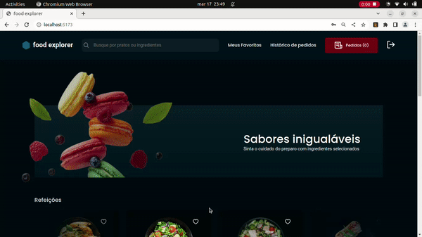
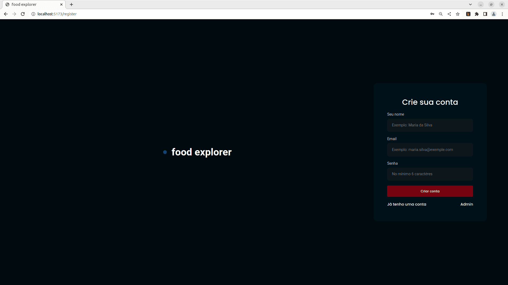
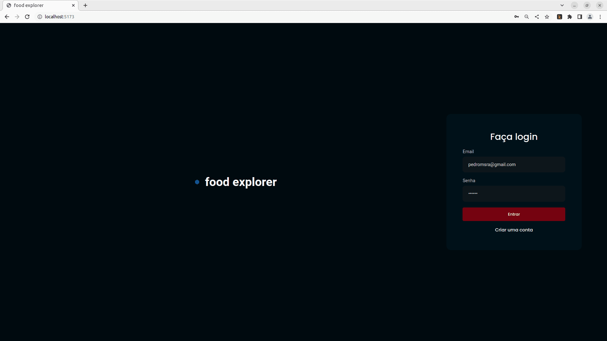
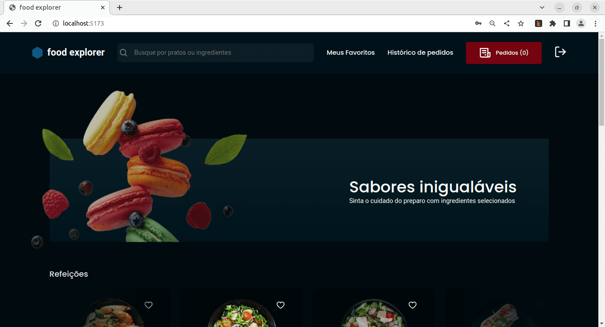

# Food Explorer

### Front End for the final challenge of the FullStack Web Developer course by RocketSeat

#### [Layout suggested by RocketSeat in Figma](https://www.figma.com/file/e1vQSjcqcy0QJOhNkeCHW3/food-explorer-v2-(Community)?node-id=5-980&t=cQBZwJ9tgkbJepQQ-0)

## Introduction

- Project developed using:
  - React v18.2.0;
  - Vite 4.1.0;
  - Styled Components;
  - React Hooks and a custom hook for user authentication;
  - Integration with [APIRest](https://github.com/pedromsra/FoodExplorer_API) that I developed in NodeJS (documentation available);
  - EFI's Pix API (GerenciaNet) (work in progress).

- Key features:
  - User authentication as Admin and Default;
  - Admin can:
    - Create and edit dishes (with image uploads);
  - Users can:
    - Favorite dishes;
    - View dish details;
    - Add dishes to their shopping list (in the application, added dishes are saved in local storage to compose the "cart");
    - View their list of added dishes ("cart");
    - Work in progress: payment (Pix and credit) and order completion.

### Clone the GitHub repository

[GitHub Repository: Food Explorer](https://github.com/pedromsra/FoodExplorer_FE)

### Starting the application

- Open the terminal and type:
  - `$ cd /path_to_the_folder_where_FE_is_saved`;
  - `$ npm install`;
  - `$ npm run dev`

## Images and Demo

### Usage

### Sign Up

### Sign Up as Admin

### Sign In

### Home

- Pending tasks:
  - 100% functional Pix API;
  - Payment API with credit card;
  - Refactor code (apply/review SOLID principles).
