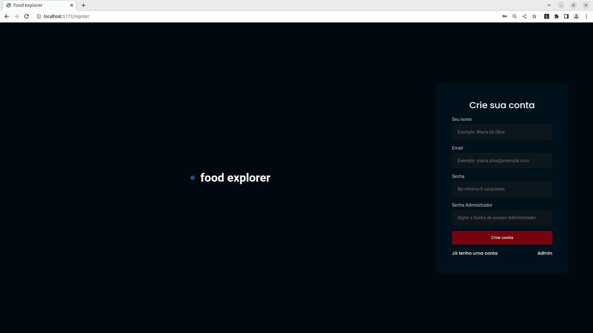

# Food Explorer (Em construção)

### Front End de desafio final do curso de desenvolvedor web FullStack RocketSeat

#### [> Link Aplicação Funcionando - Deploy no Netlify <](https://fooodexp.netlify.app/)

#### [Layot sugerido pela RocketSeat no Figma](https://www.figma.com/file/e1vQSjcqcy0QJOhNkeCHW3/food-explorer-v2-(Community)?node-id=5-980&t=cQBZwJ9tgkbJepQQ-0)

## Apresentação

- Projeto desenvolvido com:
  - React v18.2.0;
  - Vite 4.1.0;
  - Styled Components;
  - Hooks React e Hook desenvolvido para a autenticação do usuário;
  - Integração de [APIRest](https://github.com/pedromsra/FoodExplorer_API) que desenvolvi em NodeJS (documentação disponível);
  - API Pix da EFI(GerenciaNet) (em andamento)

- Principais funcionalidades:
  - Autenticação de usuário, como Admin e Default;
  - Como Admin:
    - Criar e Editar pratos (com upload de imagem);
  - User:
    - Favoritar pratos;
    - Ver detalhes dos pratos;
    - Adicionar pratos para compra (na aplicação os pratos adicionados são salvos no localstorage para compor o "carrinho");
    - Ver sua lista de pratos adicionados ("carrinho")
    - Em andamento: pagamento (pix e crédito) e finalização de pedido;

### Clonar repositório do github

[Diretório Github: Food Explorer](https://github.com/pedromsra/FoodExplorer_FE)

### Iniciando a aplicação

- Abrir terminal e digitar:
  - `$ cd /local_da_pasta_onde_a_FE_está_salva`;
  - `$ npm install`;
  - `$ npm run dev`

## Imagens e vídeo de funcionamento

### Utitlização

### SignUp

### SignUp como admin

### SignIn

### Home

- Pendencias:
  - API Pix funcionando 100%;
  - API para pagamento com cartão de crédito;
  - Refatorar código (aplicar/revisar SOLID);